# Entrega 2 - Hibernate

¡Felicitaciones!  La prueba de concepto ha sido exitosa.  Se ha aprobado el presupuesto para desarrollar el juego World Of Epers y es hora de empezar a implementar funcionalidad.

## Cambios desde el TP anterior
Se identificaron una serie de cambios necesarios a hacerse sobre la prueba de concepto anterior:

- La capa de persistencia deberá cambiarse para utilizar Hibernate/JPA en lugar de JDBC.

## Funcionalidad

### Personajes

Existen personajes (cada jugador dentro del sistema es representado por un `Personaje`).  Un personaje tiene un nombre (el cual debe ser único), un conjunto de atributos, un inventario, una cierta cantidad de puntos de experiencia, una billetera y un nivel.

Distintas acciones en el juego harán que la cantidad de puntos de experiencia del personaje se incrementen. Cuando los mismos superen un cierto límite especificado en cada nivel,  el personaje subirá de nivel.

- *Niveles de 1 a 10*: (100 * nivel) puntos de experiencia
- *Niveles de 11 a 20*: (200 * nivel) puntos de experiencia
- *Niveles de 21 a 50*: (400 * nivel) puntos de experiencia
- *Niveles de 51 en adelante*: suben cada (800 * nivel) puntos de experiencia

Por ejemplo: si estoy en nivel 1, tengo que ganar 100 de experiencia para pasar al nivel 2.
Para pasar al nivel 3 tengo que ganar 200 puntos de experiencia extra (osea el personaje tiene que tener como mínimo 300 xp para subir al nivel 3)


Adicionalmente cada personaje poseerá también una ubicación en la que se encuentra actualmente.
Además el personaje tiene una mochila donde guarda todos los items que va obteniendo. La mochila tiene una capacidad máxima de almacenamiento de 10 items.  

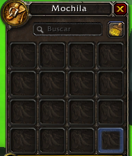 
 
### Atributos
Cada personaje tiene atributos. Los atributos tienen un tipo (Fuerza, Armadura, Destreza, Vida y Daño ) y un valor.
Los valores aumentan cuando el personaje sube de nivel.


### Inventario
 Un inventario tiene 6 slots. Cada slots tiene un tipo de ubicación y puede contener un item con el mismo tipo de ubicación.
 Las ubicaciones disponibles son:
 
- Cabeza
- Torso
- Piernas
- Pies
- Mano izquierda
- Mano derecha

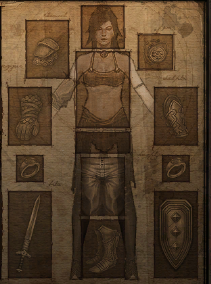

### Items
Dentro del juego existe una gran variedad de items. Cada `Item` tiene las siguientes propiedades:

- Nombre
- Ubicacion (Cabeza, Piernas, etc)
- Tipo (Espada, Arco, Flechas, Escudo, Botas, Casco, etc)
- Clases que la pueden usar
- Requerimientos 
- Costo de compra
- Costo de venta
- Atributos (Pueden aumentar los atributos del personaje)
 
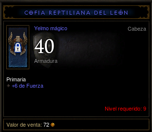

Un personaje puede obtener items en recompensas de algunas misiones o puede comprarlos en una tienda.

### Requerimientos
Existen varias entidades que requieren ciertos requisitos para poder realizar alguna acción. 
Los distintos requisitos disponibles son:
 - Nivel
 - Fuerza
 - Destreza

Cada requisito está acompañado por un valor. Para que el personaje cumpla con el requisito tiene que tener un valor igual o mayor al mismo.
Un requerimiento puede tener más de un requisito.


### Clase
Los personajes al subir de nivel aumentan sus atributos. Este aumento está dado por la clase del personaje. 
Cada clase define un porcentaje de aumento que tiene que tener cada atributo. 

Por ejemplo: 
 - __GUERRERO__: Fuerza: 10%, Destreza: 3%, Vida: 8%
 - __MAGO__: Fuerza: 2%, Destreza: 9%, Vida: 5% 


### Lugares
Dentro del juegos existen lugares donde puede estar un personaje. Todo lugar tendrá un nombre que deberá ser único.  
Hay distintos tipos de lugares: `Tiendas`, `Tabernas` y `Gimnasios`.

En las Tiendas se pueden comprar y vender items.
En las Tabernas se pueden iniciar misiones .
En los gimnasios se pueden combatir contra otros personajes.

#### Tiendas
<div>
    <span>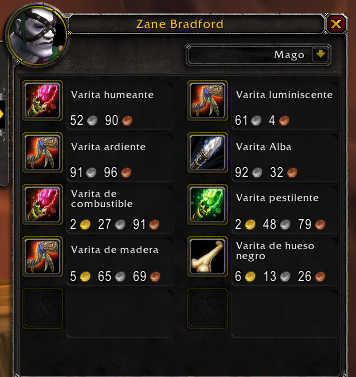</span>
    <span>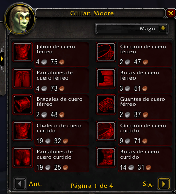</span>
</div>


### Misiones 
Los personajes pueden completar misiones para obtener recompensas. Cada misión tiene un nombre único. </br> 
Para que un personaje complete la misión, primero tiene que aceptarla y luego cumplir los requerimientos de dicha misión.
Hay distintos tipos de misiones:
 - Vencer a `x` monstruos.
 - Ir a un Lugar determinado
 - Obtener un item específico 
 - Ganar `x` veces un combate contra otro personaje
 
 
<div>
    <span>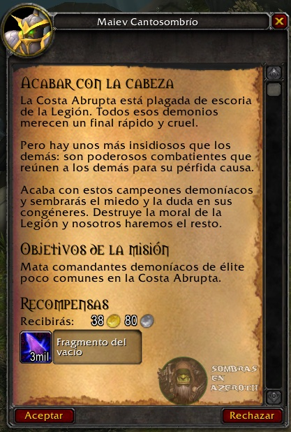</span>
    <span>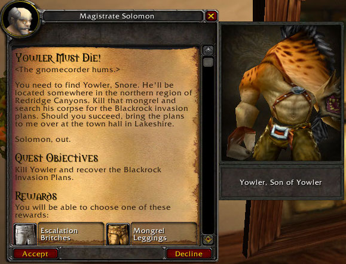</span>
    <span>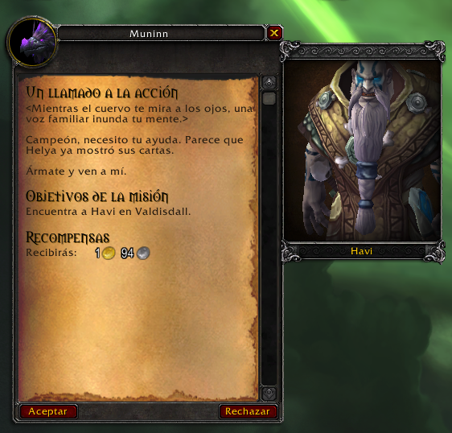</span>
</div>


Al completar una misión pueden suceder dos cosas: </br>
__Primero__ El personaje recibe la recompensa. Las recompensas posibles para el personaje pueden ser: Items, experiencia, y monedas. Si es un item, este se guarda en el mochila del personaje. </br> 
__Segundo__ Liberar nuevas misiones. 
 

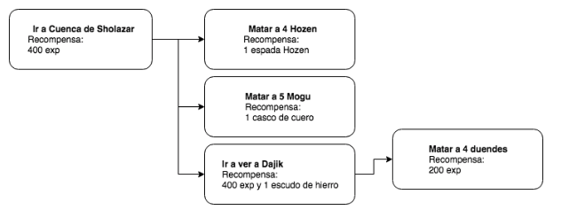


### Monstruos
En algunas misiones aparecen algunos monstruos que el personaje tiene que vencer para completar la misión.
Cada monstruo tiene vida, daño y un tipo. Los tipos de monstruos pueden ser: `Dragón`, `Lobo`, `Tigre`, `Duende` etc.

<div>
    <span>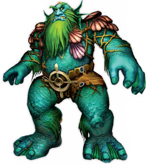</span>
    <span>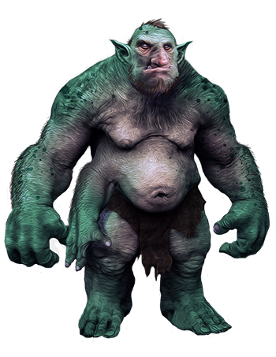</span>
    <span>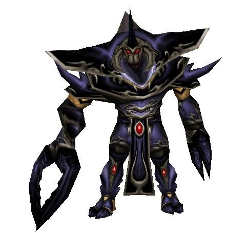</span>
    <span>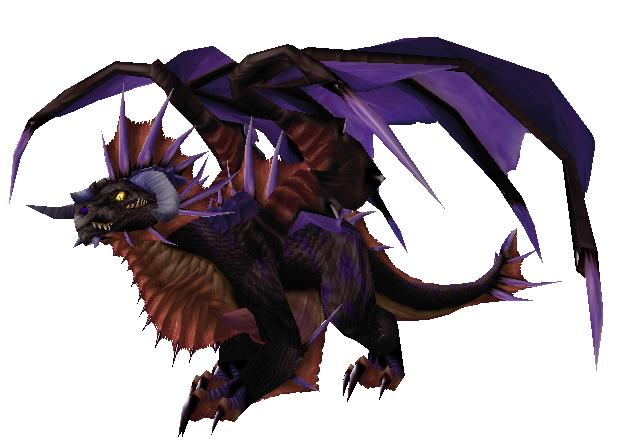</span>
</div>


### Combate
Un personaje puede llegar a pelear contra otro personaje o contra un monstruo. 
El combate consistirá en una serie de ataques.
- El primer ataque lo dará el personaje.
- El segundo ataque lo dará el rival.
- El personaje y el enemigo alternaran ataques hasta que alguno de los dos se quede sin vida.
- Luego del combate, la vida del personaje se restaura.

El vencedor del combate ganará `10 * nivel` de experiencia (si es un personaje).


**Para calcular el daño que genera un personaje utilizar esta fórmula:**

```
Daño = DañoArma * (Fuerza + (Destreza / 100) / 100)
DañoArma = DañoArmaDerecha + (DañoArmaIzquierda * 35%)

Ejemplo: 

DañoArmaDerecha: 30
DañoArmaIzquierda: 20
Fuerza: 25
Destreza: 20
Daño = (30 + (20 * 0.35)) * ((25 + (20/100)) / 100) = 183,96

```


**El daño que recibe un personaje se calcula de la siguiente forma:**:

```
Defensa =  Armadura + ( DañoGenerado * 10%)
DañoRecibido = DañoDelAtacante - Defensa

Ejemplo:

DañoDelAtacante = 200
Armadura = 50
DañoGenerado = 150
Defensa = 50 + (200 * 10%)
DañoRecibido = 200 - 70 = 130

En este caso el atacado recibió un golpe de 130 puntos de vida.

```

PD: Para calcular los atributos de combate de un personaje tienen que tener en cuenta los atributos base más 
los atributos de los items.  


## Servicios
Se pide que implementen los siguientes servicios los cuales serán consumidos por el frontend de la aplicación.

### PersonajeService
- `equipar(personaje, item)` El personaje se equipa el item, es decir, lo agrega a su inventario. Si el inventario del personaje ya tiene un item en esa posición, este se mueve a la mochila. El item a equipar debe estar en la mochila del personaje. Validar que el usuario cumple los requisitos para equiparse el item.

- `combatir(personaje1, personaje2):ResultadoCombate` Se realiza un combate entre los dos personajes. Validar que el personaje se encuentre en un gimnasio. . El objeto resultante `ResultadoCombate` informará no solo quién fue el ganador del combate sino el resultado de cada uno de los ataques realizados.


### LugarService
- `listarMisiones(personaje):List<Mision>` Devuelve la lista de misiones disponibles para un jugador. Validar que el personaje se encuentre en una `Taberna`

- `aceptarMision(personaje, mision):List<Mision>` El personaje acepta la mision. Validar que el personaje se encuentre en una `Taberna` y que la mision este disponible.

- `completarMision(personaje, misión)` El personaje completa la misión (si la habia aceptado previamente y cumple todos los requisitos) y recibe la recompensa. Validar que la misión esté disponible. 

- `mover(personaje, lugar)` Cambia la ubicación actual del personaje por la especificada por parámetro.

- `listarItems(personaje):List<Item>` Devuelve una lista de items disponibles que tiene la tienda. Validar que el personaje se encuentre en una `Tienda`.

- `comprarItem(personaje, item)` El personaje obtiene el item y se le debita el costo del mismo. Validar que tenga la cantidad de monedas necesarias para comprar el item.

- `venderItem(personaje, item)` El personaje vende el item y se le acredita el costo del mismo.

### LeaderboardService

- `campeones():List<Personaje>` Retorna los diez personajes que ganaron mas batallas contra otros personajes ordenado de mayor a menor.
- `razaLider():Raza` Retorna la raza que tenga mas batallas ganadas contra otros personajes.
- `claseLider():Clase` Retorna la clase que tenga mas batallas ganadas contra otros personajes.
- `masFuerte():Personaje` Retorna el personaje que produzca mas daño. 

## Se pide:
- Que provean implementaciones para las interfaces descritas anteriormente.
- Que modifiquen el mecanismo de persistencia de la clase `Raza` de forma de que todo el modelo persistente utilice Hibernate.
- Asignen propiamente las responsabilidades a todos los objetos intervinientes, discriminando entre servicios, DAOs y objetos de negocio.
- Creen test unitarios para cada unidad de código entregada que prueben todas las funcionalidades pedidas, con casos favorables y desfavorables.

### Consejos útiles:
- Enfóquese primero en el modelo y la capa de servicios, traten de asignar responsabilidades a sus objetos para resolver los casos de uso propuestos.
- Pueden comenzar trabajando con implementaciones mock de su capa de DAOs. No es necesario que utilicen algún framework de mocking, pueden simplemente codificar DAOs que persistan los objetos en mapas y los recuperen desde ahi.
- Una vez que tengan el modelo terminado y validado, persistanlo utilizando hibernate, en este punto deberán analizar:

   - Qué objetos deben ser persistentes y cuáles no?
   - Cuál es la cardinalidad de cada una de las relaciones? Como mapearlas?


